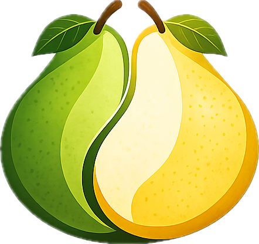
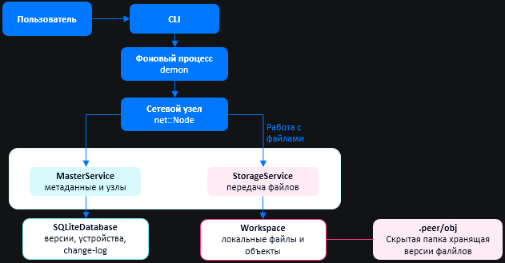
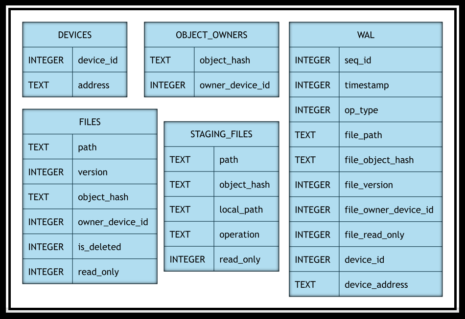
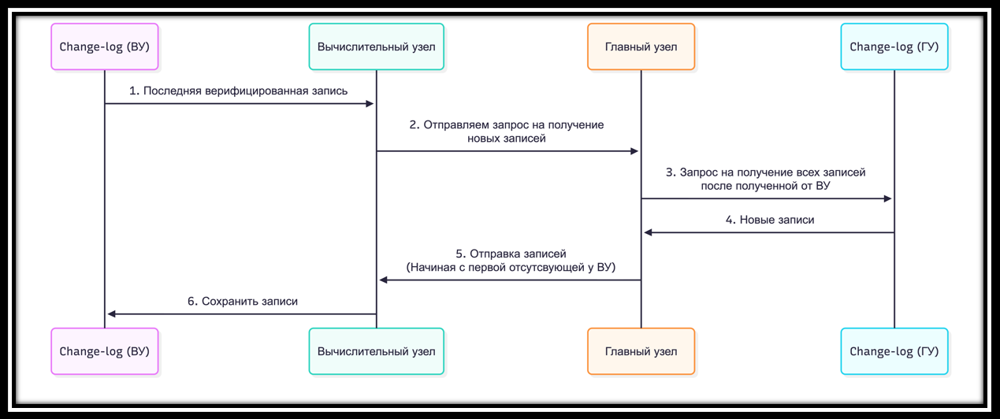

<p align="center">
  
</p>

<h1 align="center">Pear-to-Pear</h1>

<p align="center">
  Cross-platform CLI application and library core for p2p file storage
</p>

<p align="center">
  <a href="https://github.com/p2pSquad/PearToPear/actions/workflows/ci.yml">
    
  </a>
</p>

<p align="center">
  
  
  
  
  
  
</p>

<p align="center">
  🇬🇧 English | 🇷🇺 <a href="./README.md">Русский</a>
</p>

---

## About

**Pear-to-Pear** is a **cross-platform C++20 CLI application** for distributed file storage and a **library core for p2p projects**.

The project combines a **shared file repository**, **versioning**, **local object storage**, **SQLite metadata** and **network synchronization between nodes**.

The idea behind Pear-to-Pear is to give a group of devices a shared file space without a dedicated file server. Each participant stores data locally, while the system maintains the shared repository state: which files exist, which versions are current and where the content can be fetched.

From the user's point of view, Pear-to-Pear behaves like a shared file drive with version history, but the data is not moved to the cloud. Files remain on participants' devices, while nodes synchronize metadata and transfer only the required file versions.

Pear-to-Pear can be used as a ready-to-use CLI application or as a foundation for custom p2p scenarios. The internal storage, versioning and synchronization logic is separated from the concrete network implementation, so the transport layer can be extended or replaced.

---

## Contents

- [Quick start](#quick-start)
- [Features](#features)
- [CLI capabilities](#cli-capabilities)
- [Workspace structure](#workspace-structure)
- [How it works](#how-it-works)
  - [Local node architecture](#local-node-architecture)
  - [Database](#database)
  - [Change-log synchronization](#change-log-synchronization)
- [Build and installation](#build-and-installation)
- [Testing and CI](#testing-and-ci)
- [Technical documentation](#technical-documentation)
- [Repository structure](#repository-structure)
- [Team](#team)
- [License](#license)

---

## Quick start

### 1. Build the project

```bash
cmake -S . -B build
cmake --build build -j
```

The binary will be available at:

```bash
./build/pear
```

To install it as `pear`:

```bash
sudo install -m 755 build/pear /usr/local/bin/pear
```

Check installation:

```bash
pear --help
```

### 2. Create two workspaces

```bash
mkdir -p /tmp/pear-main /tmp/pear-peer

pear init /tmp/pear-main
pear init /tmp/pear-peer
```

### 3. Start the main node

```bash
cd /tmp/pear-main
pear connect --main --listen 127.0.0.1:50051
```

### 4. Connect another node

```bash
cd /tmp/pear-peer
pear connect --gu 127.0.0.1:50051 --listen 127.0.0.1:50052
```

### 5. Add and publish a file

```bash
cd /tmp/pear-main
printf 'hello from pear\n' > note.txt

pear add note.txt
pear push
```

### 6. Update state and pull the file on another node

```bash
cd /tmp/pear-peer
pear update
pear pull note.txt
cat note.txt
```

---

## Features

### Distributed file storage

Files are stored on participants' devices. Pear-to-Pear does not require a dedicated server that stores the whole repository content.

### Shared file repository

Nodes work with a shared list of files and versions. The repository state can be inspected with `pear ls`, and local changes can be inspected with `pear status`.

### Versioning

File changes are stored as versions. Content is identified by object hashes, so identical data does not have to be stored multiple times.

### Metadata synchronization

Metadata is synchronized through a change-log. Nodes receive new operations, apply them to the local database and converge to the shared repository state.

### Readonly mode

A file can be added or converted to readonly mode. This allows Pear-to-Pear to keep the content as an object inside `.peer` without storing an extra working copy.

### Extensible core

Storage, versioning and synchronization logic is separated from the concrete network implementation. The transport layer can be extended for other p2p scenarios.

---

## CLI capabilities

### Repository creation

```bash
pear init <workspace_path>
pear deinit
```

### Node connection

```bash
pear connect --main --listen <ip:port>
pear connect --gu <ip:port> --listen <ip:port>
pear disconnect
```

### File operations

```bash
pear add <path>...
pear add --all
pear add --readonly <path>...

pear unstage <path>...
pear unstage --all
```

### Readonly mode

```bash
pear readonly <path>...
pear readonly --off <path>...
```

### Cleanup

```bash
pear cleanup <keep_versions> <path>...
pear cleanup <keep_versions> --all
```

### Repository state

```bash
pear status
pear status --json

pear ls
pear ls --json

pear log
pear log --tail <n>
```

### Synchronization and download

```bash
pear update
pear push

pear pull <file-or-dir>...
pear pull --no-share <file-or-dir>...
```

---

## Workspace structure

After initialization, Pear-to-Pear creates a working directory with user files and a service directory named `.peer`.

```text
workspace/
├── user files...
└── .peer/
    ├── meta
    ├── obj/
    └── config
```

- `workspace/` - regular user files;
- `.peer/meta` - local SQLite metadata database;
- `.peer/obj/` - object storage for file versions;
- `.peer/config` - local node configuration.

File content is stored separately from metadata. The database knows which versions exist and which devices provide them, while the actual versions are stored in the object storage.

---

## How it works

### Local node architecture

The main user entry point is CLI. Commands are passed to the background process `demon`, which runs a local network node and interacts with synchronization and storage services.

<p align="center">
  
</p>

The node has two main services:

- `MasterService` - metadata, devices, versions and change-log;
- `StorageService` - file content transfer between peers.

Below them are two storage layers:

- `SqliteDatabase` - repository state;
- `Workspace` - user files and object storage.

### Database

Each node stores a local metadata copy in SQLite.

<p align="center">
  
</p>

Main entities:

- `DEVICES` - known devices;
- `FILES` - files, versions and current state;
- `OBJECT_OWNERS` - devices that provide object content;
- `STAGING_FILES` - local changes before publishing;
- `WAL` - operation log for state synchronization.

### Change-log synchronization

Metadata is synchronized through a change-log. The main node coordinates operation ordering, but it is not a central file server.

<p align="center">
  
</p>

A node reports the last known record, receives missing operations, stores them locally and applies them to its database. Files are not sent together with metadata: content is downloaded separately with `pear pull`.

---

## Build and installation

### Dependencies for Ubuntu / Debian / WSL

```bash
sudo apt update
sudo apt install -y \
    cmake \
    g++ \
    pkg-config \
    protobuf-compiler \
    protobuf-compiler-grpc \
    libprotobuf-dev \
    libgrpc++-dev \
    libsqlite3-dev \
    libssl-dev
```

### Build

```bash
cmake -S . -B build
cmake --build build -j
```

### Install binary

```bash
sudo install -m 755 build/pear /usr/local/bin/pear
```

### Remove binary

```bash
sudo rm -f /usr/local/bin/pear
```

---

## Testing and CI

Run tests locally:

```bash
ctest --test-dir build --output-on-failure
```

Build and tests also run in GitHub Actions:

- [GitHub Actions](https://github.com/p2pSquad/PearToPear/actions)

---

## Technical documentation

Detailed documentation is stored in `docs/`:

- [Project architecture](docs/architecture.md)
- [CLI reference](docs/cli.md)
- [Using Pear-to-Pear as a library](docs/library-usage.md)
- [Transport layer extension](docs/transport.md)

Transport layer extension example:

- [PearToPearRelay](https://github.com/p2pSquad/PearToPearRelay)

---

## Repository structure

```text
PearToPear/
├── docs/          # documentation, diagrams and project materials
├── proto/         # Protobuf and gRPC definitions
├── include/       # public headers
├── src/           # implementation
├── tests/         # tests
└── CMakeLists.txt
```

---

## Team

<table align="center">
  <tr>
    <td align="center" width="180">
      <a href="https://github.com/dmkornef">
        
      </a>
      <br />
      <b>Dmitry Kornev</b>
    </td>
    <td align="center" width="180">
      <a href="https://github.com/Borow22">
        
      </a>
      <br />
      <b>Stanislav Lamash</b>
    </td>
    <td align="center" width="180">
      <a href="https://github.com/iffka">
        
      </a>
      <br />
      <b>Dmitry Timofeev</b>
    </td>
  </tr>
</table>

---

## License

The project is distributed under the license specified in [LICENSE](LICENSE).

---

<p align="center">
  Made with C++20 and love by HSE SPb AMI 2029 students
</p>
