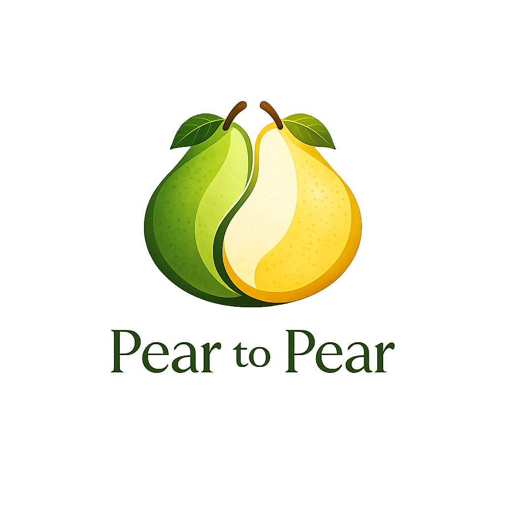

# Pear-to-Pear (p2p storage) - MVP

<table>
  <tr>
    <td width="320">
      
    </td>
    <td>

Pear-to-Pear - это p2p-сервис для хранения набора файлов на разных устройствах.

В текущем MVP:
- линейная структура без папок
- терминальный интерфейс
- базовые операции: добавить, синхронизировать, скачать
- метаданные синхронизируются между устройствами
- сами файлы хранятся на устройствах участников

    </td>
  </tr>
</table>

## Ограничения MVP

- поддерживается только линейная структура без папок
- текущая реализация рассчитана на Linux
- тестировалось на Linux / WSL
- доступность данных не гарантируется, если устройство-владелец нужной версии не в сети

## Структура репозитория

- `docs/` - дизайн, описание MVP, заметки
- `examples/` - эксперименты и черновики
- `proto/` - protobuf / gRPC описание сообщений и сервисов
- `src/` - основной код проекта
  - `main.cpp` - точка входа CLI
  - `pear/fs/` - файловый слой
  - `pear/db/` - SQLite и метаданные
  - `pear/net/` - сетевой слой
  - `pear/cli/` - реализация команд
  - `pear/demon/` - фоновый процесс узла
- `tests/` - тесты

## Стек

- C++20
- gRPC
- Protobuf
- SQLite
- `std::filesystem`
- CLI11
- gTest

## Зависимости

Для Ubuntu / Debian / WSL:

```bash
sudo apt update
sudo apt install -y \
    cmake \
    g++ \
    pkg-config \
    protobuf-compiler \
    protobuf-compiler-grpc \
    libprotobuf-dev \
    libgrpc++-dev \
    libsqlite3-dev
```

## Сборка

```bash
rm -rf build
cmake -S . -B build
cmake --build build -j
```

Бинарник после сборки:

```bash
./build/pear
```

## Установка бинарника в систему

Чтобы можно было запускать программу просто как `pear`:

```bash
sudo install -m 755 build/pear /usr/local/bin/pear
```

Проверка:

```bash
pear --help
```

Удаление бинарника:

```bash
sudo rm -f /usr/local/bin/pear
```

## Быстрый старт

### 1. Создать два workspace

```bash
mkdir -p /tmp/pear-main /tmp/pear-peer

pear init /tmp/pear-main
pear init /tmp/pear-peer
```

### 2. Поднять главный узел

```bash
cd /tmp/pear-main
pear connect --main --listen 127.0.0.1:50051
```

### 3. Подключить обычный узел

```bash
cd /tmp/pear-peer
pear connect --gu 127.0.0.1:50051 --listen 127.0.0.1:50052
```

### 4. Добавить и отправить файл с main

```bash
cd /tmp/pear-main
printf 'hello\n' > note.txt
pear add note.txt
pear push
```

### 5. Подтянуть файл на peer

```bash
cd /tmp/pear-peer
pear update
pear pull note.txt
cat note.txt
```

## Основные команды

```bash
pear init <workspace_path>
pear deinit

pear connect --main --listen <ip:port>
pear connect --gu <ip:port> --listen <ip:port>

pear disconnect

pear add <path>...
pear add --all

pear unstage <path>...
pear unstage --all

pear status
pear ls
pear update
pear push
pear pull <file>...
```

## Как это работает

- каждый узел хранит локальный workspace с `.peer`
- в `.peer/meta` лежит локальная SQLite БД с метаданными
- в `.peer/obj` лежат object-файлы версий
- `add` кладёт файл в локальный staging
- `push` создаёт новую версию object-файла и отправляет WAL-изменение на главный узел
- `update` синхронизирует метаданные
- `pull` скачивает содержимое файла с устройства-владельца текущей версии

## Что уже работает в MVP

- инициализация workspace
- подключение main / peer
- локальный staging
- просмотр состояния (`status`, `ls`)
- публикация новой версии файла (`push`)
- синхронизация метаданных (`update`)
- скачивание файла (`pull`)
- корректное завершение (`disconnect`, `deinit`)

## Команда

- Корнев Дмитрий
- Ламаш Станислав
- Тимофеев Дмитрий

## Misc
- Презентация: https://docs.google.com/presentation/d/1x6lRDGvlefZQ8AkGxKAqevRZLaS2QIhb6SvRDHYG3wk/edit?usp=sharing
